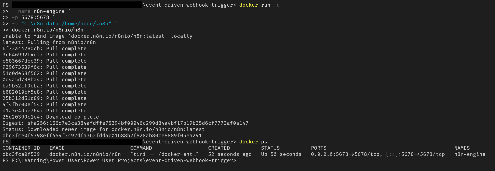
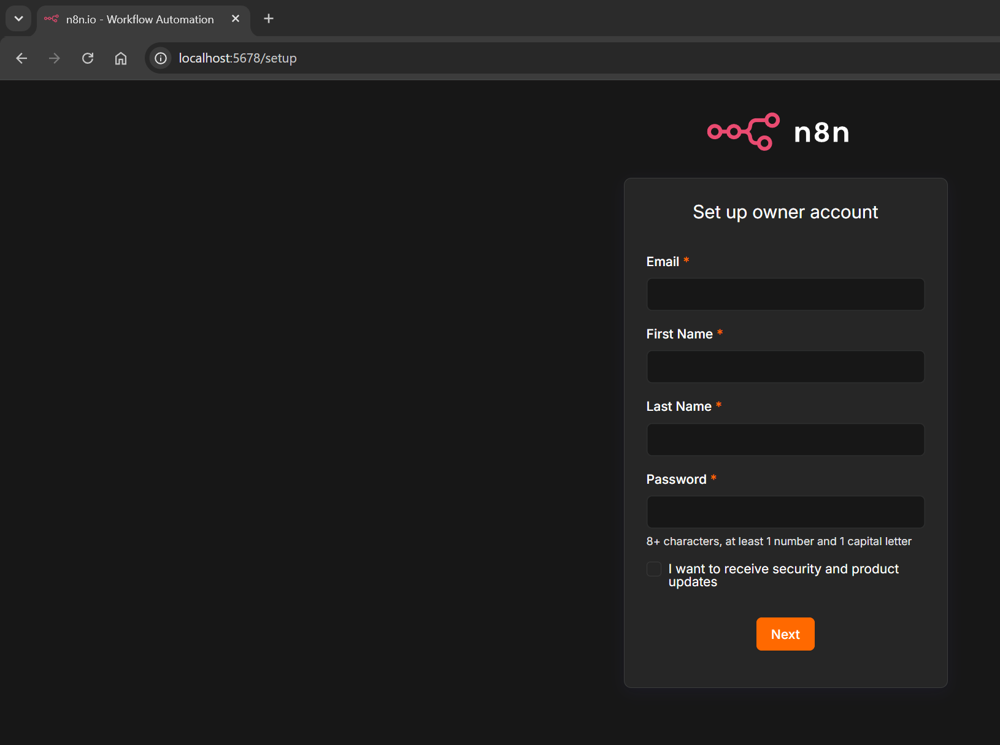
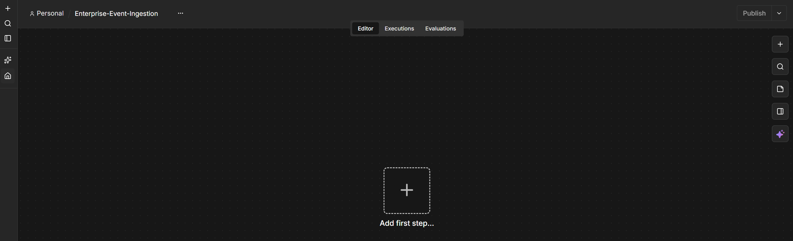
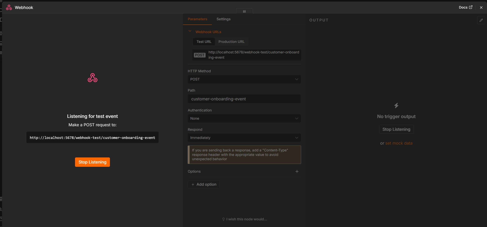
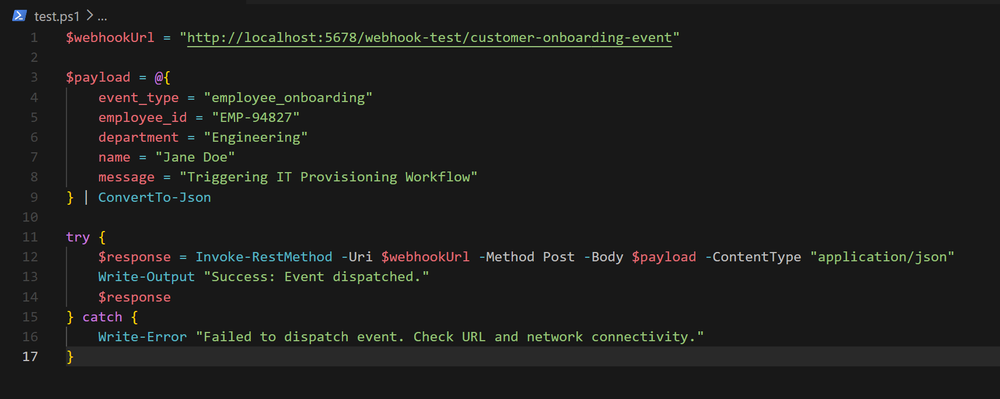
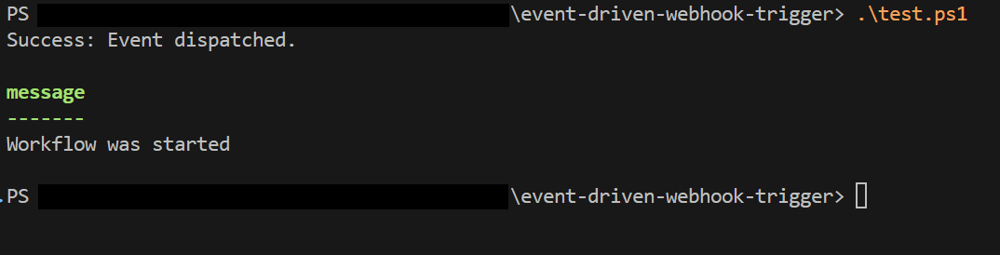
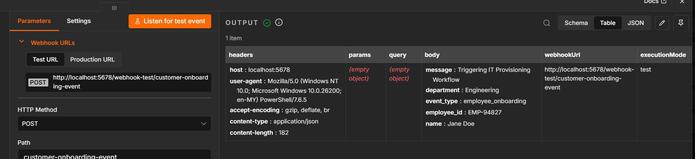

# Event-Driven Webhook Trigger

A hands-on automation lab using **n8n** and **PowerShell** to simulate an enterprise event-driven workflow. A PowerShell script fires a webhook event that triggers an n8n workflow — mimicking real-world IT provisioning pipelines.

---

## What This Does

A PowerShell script sends a JSON payload to an n8n webhook endpoint. n8n listens for the event and starts a workflow in response — representing an automated trigger for employee onboarding or IT provisioning tasks.

---

## Tech Stack

- **n8n** — self-hosted workflow automation (via Docker)
- **Docker** — container runtime for running n8n locally
- **PowerShell** — script to fire the webhook event

---

## Setup

### 1. Run n8n with Docker

```powershell
docker run -d --name n8n-engine -p 5678:5678 -v "C:\n8n-data:/home/node/.n8n" docker.n8n.io/n8nio/n8n
```

Verify the container is running:

```powershell
docker ps
```



### 2. Access n8n

Open your browser and go to:

```
http://localhost:5678
```

Complete the owner account setup on first launch.



### 3. Create the Workflow in n8n

- Create a new workflow named **Enterprise-Event-Ingestion**
- Add a **Webhook** node with the following config:
  - HTTP Method: `POST`
  - Path: `customer-onboarding-event`
  - Respond: `Immediately`
- Click **Listen for test event** to activate the listener





---

## Firing the Webhook

Run the PowerShell script to dispatch the event:

```powershell
.\test.ps1
```



### test.ps1

```powershell
$webhookUrl = "http://localhost:5678/webhook-test/customer-onboarding-event"

$payload = @{
    event_type  = "employee_onboarding"
    employee_id = "EMP-94827"
    department  = "Engineering"
    name        = "Jane Doe"
    message     = "Triggering IT Provisioning Workflow"
} | ConvertTo-Json

try {
    $response = Invoke-RestMethod -Uri $webhookUrl -Method Post -Body $payload -ContentType "application/json"
    Write-Output "Success: Event dispatched."
    $response
} catch {
    Write-Error "Failed to dispatch event. Check URL and network connectivity."
}
```

---

## Expected Output

PowerShell terminal:

```
Success: Event dispatched.

message
-------
Workflow was started
```



n8n webhook node receives:

| Field | Value |
|---|---|
| event_type | employee_onboarding |
| employee_id | EMP-94827 |
| department | Engineering |
| name | Jane Doe |
| message | Triggering IT Provisioning Workflow |



---

## Key Concepts

- **Webhook trigger** — n8n listens on a URL and starts a workflow when a POST request arrives
- **Event-driven architecture** — the script acts as the event producer; n8n is the consumer
- **Docker volume** — `C:\n8n-data` persists n8n data across container restarts
